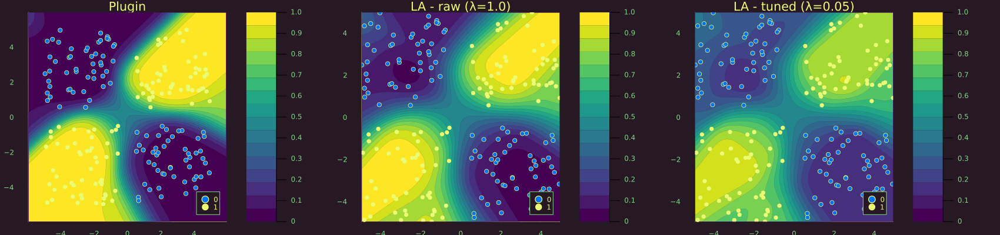

# LaplaceRedux

[](https://pat-alt.github.io/LaplaceRedux.jl/stable) [](https://pat-alt.github.io/LaplaceRedux.jl/dev) [](https://github.com/pat-alt/LaplaceRedux.jl/actions/workflows/CI.yml?query=branch%3Amain) [](https://codecov.io/gh/pat-alt/LaplaceRedux.jl) [](https://github.com/invenia/BlueStyle) [](https://github.com/SciML/ColPrac) [](https://twitter.com/paltmey)

`LaplaceRedux.jl` is a library written in pure Julia that can be used for effortless Bayesian Deep Learning trough Laplace Approximation (LA). In the development of this package I have drawn inspiration from this Python [library](https://aleximmer.github.io/Laplace/index.html#setup) and its companion [paper](https://arxiv.org/abs/2106.14806) (Daxberger et al. 2021).

## 🚩 Installation

The stable version of this package can be installed as follows:

``` julia
using Pkg
Pkg.add("LaplaceRedux.jl")
```

The development version can be installed like so:

``` julia
using Pkg
Pkg.add("https://github.com/pat-alt/LaplaceRedux.jl")
```

## 🖥️ Basic Usage

`LaplaceRedux.jl` can be used for any neural network trained in [`Flux.jl`](https://fluxml.ai/Flux.jl/dev/). Below we show basic usage examples involving two simple models for a regression and a classification task, respectively.

### Regression

A complete worked example for a regression model can be found in the [docs](https://www.paltmeyer.com/LaplaceRedux.jl/dev/tutorials/regression/). Here we jump straight to Laplace Approximation and take the pre-trained model `nn` as given. Then LA can be implemented as follows, where we specify the model `likelihood` and supply pre-determined values for the prior precision `λ` and the observational noise `σ`. The plot show the fitted values overlayed with a 95% confidence interval. As expected, predictive uncertainty quickly increases in areas that are not populated by any training data.

``` julia
la = Laplace(nn; likelihood=:regression, λ=λ, σ=σtrue)
fit!(la, data)
plot(la, X, y)
```


### Binary Classification

Once again we jump straight to LA and refer to the [docs](https://www.paltmeyer.com/LaplaceRedux.jl/dev/tutorials/mlp/) for a complete worked example involving binary classification. In this case we need to specify `likelihood=:classification`. The plot below shows the resulting posterior predictive distributions as contours in the two-dimensional feature space: note how the **Plugin** Approximation on the left compares to the Laplace Approximation on the right.

``` julia
la = Laplace(nn; likelihood=:classification, λ=λ)
fit!(la, data)

# Plot the posterior predictive distribution:
p_plugin = plot(la, X, ys; title="Plugin", link_approx=:plugin, clim=(0,1))
p_laplace = plot(la, X, ys; title="Laplace", clim=(0,1))
plot(p_plugin, p_laplace, layout=(1,2), size=(1000,400))
```



## 📢 JuliaCon 2022

This project was presented at JuliaCon 2022 in July 2022. See [here](https://pretalx.com/juliacon-2022/talk/Z7MXFS/) for details.

## 🛠️ Contribute

Contributions are very much welcome! Please follow the [SciML ColPrac guide](https://github.com/SciML/ColPrac). You may want to start by having a look at any open issues.

## ❎ Known Limitations

This library currently offers native support only for models composed and trained in Flux. It also still lacks out-of-the-box support for hyperparameter tuning.

## 🎓 References

Daxberger, Erik, Agustinus Kristiadi, Alexander Immer, Runa Eschenhagen, Matthias Bauer, and Philipp Hennig. 2021. “Laplace Redux-Effortless Bayesian Deep Learning.” *Advances in Neural Information Processing Systems* 34.
