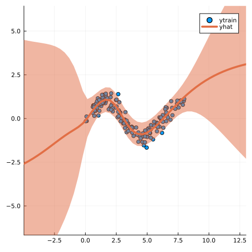

``` @meta
CurrentModule = LaplaceRedux
```

# LaplaceRedux

Documentation for [LaplaceRedux.jl](https://github.com/pat-alt/LaplaceRedux.jl).

`LaplaceRedux.jl` is a library written in pure Julia that can be used for effortless Bayesian Deep Learning trough Laplace Approximation (LA). In the development of this package I have drawn inspiration from this Python [library](https://aleximmer.github.io/Laplace/index.html#setup) and its companion [paper](https://arxiv.org/abs/2106.14806) (Daxberger et al. 2021).

## 🚩 Installation

The stable version of this package can be installed as follows:

``` julia
using Pkg
Pkg.add("LaplaceRedux.jl")
```

The development version can be installed like so:

``` julia
using Pkg
Pkg.add("https://github.com/pat-alt/LaplaceRedux.jl")
```

## 🖥️ Basic Usage

`LaplaceRedux.jl` can be used for any neural network trained in [`Flux.jl`](https://fluxml.ai/Flux.jl/dev/). Below we show basic usage examples involving two simple models for a regression and a classification task, respectively.

### Regression

A complete worked example for a regression model can be found in the [docs](https://www.paltmeyer.com/LaplaceRedux.jl/dev/tutorials/regression/). Here we jump straight to Laplace Approximation and take the pre-trained model `nn` as given. Then LA can be implemented as follows, where we specify the model `likelihood`. The plot show the fitted values overlayed with a 95% confidence interval. As expected, predictive uncertainty quickly increases in areas that are not populated by any training data.

``` julia
la = Laplace(nn; likelihood=:regression)
fit!(la, data)
optimize_prior!(la)
plot(la, X, y; zoom=-5, size=(400,400))
```



### Binary Classification

Once again we jump straight to LA and refer to the [docs](https://www.paltmeyer.com/LaplaceRedux.jl/dev/tutorials/mlp/) for a complete worked example involving binary classification. In this case we need to specify `likelihood=:classification`. The plot below shows the resulting posterior predictive distributions as contours in the two-dimensional feature space: note how the **Plugin** Approximation on the left compares to the Laplace Approximation on the right.

``` julia
la = Laplace(nn; likelihood=:classification)
fit!(la, data)
la_untuned = deepcopy(la)   # saving for plotting
optimize_prior!(la; verbose=true, n_steps=500)

# Plot the posterior predictive distribution:
zoom=0
p_plugin = plot(la, X, ys; title="Plugin", link_approx=:plugin, clim=(0,1))
p_untuned = plot(la_untuned, X, ys; title="LA - raw (λ=$(unique(diag(la_untuned.P₀))[1]))", clim=(0,1), zoom=zoom)
p_laplace = plot(la, X, ys; title="LA - tuned (λ=$(round(unique(diag(la.P₀))[1],digits=2)))", clim=(0,1), zoom=zoom)
plot(p_plugin, p_untuned, p_laplace, layout=(1,3), size=(1700,400))
```

    Iteration 50: P₀=0.06080220040262144, σ=1.0

    loss(exp.(logP₀), exp.(logσ)) = 25.700731337819576
    Iteration 100: P₀=0.03864448374363554, σ=1.0


    loss(exp.(logP₀), exp.(logσ)) = 24.385333791169938

    Iteration 150: P₀=0.03407170744815622, σ=1.0
    loss(exp.(logP₀), exp.(logσ)) = 24.300861656631366
    Iteration 200: P₀=0.03291185032022732, σ=1.0


    loss(exp.(logP₀), exp.(logσ)) = 24.295534970827646

    Iteration 250: P₀=0.032685898252189316, σ=1.0
    loss(exp.(logP₀), exp.(logσ)) = 24.295354166355335
    Iteration 300: P₀=0.032658417387831706, σ=1.0


    loss(exp.(logP₀), exp.(logσ)) = 24.29535183069232

    Iteration 350: P₀=0.03265709523177021, σ=1.0
    loss(exp.(logP₀), exp.(logσ)) = 24.2953518263952
    Iteration 400: P₀=0.03265717759247646, σ=1.0


    loss(exp.(logP₀), exp.(logσ)) = 24.2953518263726

    Iteration 450: P₀=0.032657184624387665, σ=1.0
    loss(exp.(logP₀), exp.(logσ)) = 24.295351826372727
    Iteration 500: P₀=0.03265718403952106, σ=1.0


    loss(exp.(logP₀), exp.(logσ)) = 24.295351826372492


## 📢 JuliaCon 2022

This project was presented at JuliaCon 2022 in July 2022. See [here](https://pretalx.com/juliacon-2022/talk/Z7MXFS/) for details.

## 🛠️ Contribute

Contributions are very much welcome! Please follow the [SciML ColPrac guide](https://github.com/SciML/ColPrac). You may want to start by having a look at any open issues.

## ❎ Known Limitations

This library currently offers native support only for models composed and trained in Flux. It also still lacks out-of-the-box support for hyperparameter tuning.

## 🎓 References

Daxberger, Erik, Agustinus Kristiadi, Alexander Immer, Runa Eschenhagen, Matthias Bauer, and Philipp Hennig. 2021. “Laplace Redux-Effortless Bayesian Deep Learning.” *Advances in Neural Information Processing Systems* 34.
