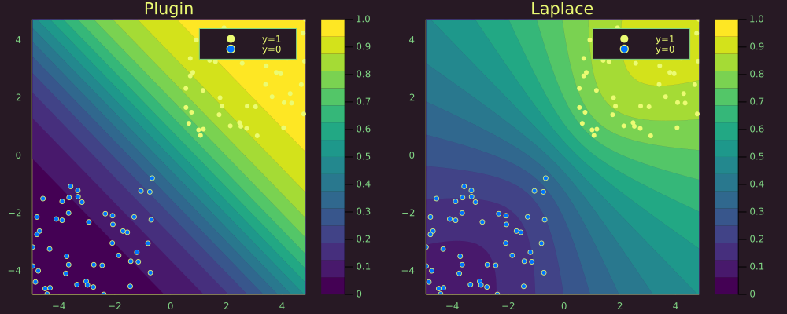

``` @meta
CurrentModule = BayesLaplace
```

# Quick start

<div class="cell" execution_count="166">

``` julia
# Import libraries.
using Flux, Plots, Random, PlotThemes, Statistics, BayesLaplace
theme(:juno)
using Logging
disable_logging(Logging.Info)
```

<div class="cell-output-display">

    LogLevel(1)

</div>

</div>

``` julia
# Number of points to generate.
N = 100
M = round(Int, N / 4)
Random.seed!(1234)

# Generate artificial data.
x1s = rand(M) * 4.5; x2s = rand(M) * 4.5; 
xt1s = Array([[x1s[i] + 0.5; x2s[i] + 0.5] for i = 1:M])
x1s = rand(M) * 4.5; x2s = rand(M) * 4.5; 
append!(xt1s, Array([[x1s[i] - 5; x2s[i] - 5] for i = 1:M]))

x1s = rand(M) * 4.5; x2s = rand(M) * 4.5; 
xt0s = Array([[x1s[i] + 0.5; x2s[i] - 5] for i = 1:M])
x1s = rand(M) * 4.5; x2s = rand(M) * 4.5; 
append!(xt0s, Array([[x1s[i] - 5; x2s[i] + 0.5] for i = 1:M]))

# Store all the data for later.
xs = [xt1s; xt0s]
X = hcat(xs...) # bring into tabular format
ts = [ones(2*M); zeros(2*M)];

plt = plot()

# Plot data points.
function plot_data!(plt,X,y)
    Plots.scatter!(plt, X[y.==1.0,1],X[y.==1.0,2], color=1, clim = (0,1), label="y=1")
    Plots.scatter!(plt, X[y.==0.0,1],X[y.==0.0,2], color=0, clim = (0,1), label="y=0")
end

plt = plot_data!(plt,X',ts);
```

<div class="cell" execution_count="168">

``` julia
function build_model(;input_dim=2,n_hidden=32,output_dim=1)
    
    # Params:
    W₁ = input_dim
    b₁ = n_hidden
    W₀ = n_hidden
    b₀ = output_dim
    
    nn = Chain(
        Dense(W₁, b₁, σ),
        Dense(W₀, b₀))  

    return nn

end
nn = build_model()
```

<div class="cell-output-display">

    Chain(
      Dense(2, 32, σ),                      # 96 parameters
      Dense(32, 1),                         # 33 parameters
    )                   # Total: 4 arrays, 129 parameters, 772 bytes.

</div>

</div>

<div class="cell" execution_count="169">

``` julia
λ = 1e-10
```

<div class="cell-output-display">

    1.0e-10

</div>

</div>

``` julia
sqnorm(x) = sum(abs2, x)
weight_regularization(λ=λ) = 1/2 * λ^2 * sum(sqnorm, Flux.params(nn))

loss(x, y) = Flux.Losses.logitbinarycrossentropy(nn(x), y) + weight_regularization()
ps = Flux.params(nn)
data = zip(xs,ts);
```

``` julia
using Flux.Optimise: update!, ADAM
opt = ADAM()
epochs = 200
avg_loss(data) = mean(map(d -> loss(d[1],d[2]), data))

using Plots
anim = Animation()
plt = plot(ylim=(0,avg_loss(data)), xlim=(0,epochs), legend=false, xlab="Epoch")
avg_l = []

for epoch = 1:epochs
  for d in data
    gs = gradient(params(nn)) do
      l = loss(d...)
    end
    update!(opt, params(nn), gs)
  end
  avg_l = vcat(avg_l,avg_loss(data))
  plot!(plt, avg_l, color=1, title="Average (training) loss")
  frame(anim, plt)
end

gif(anim, "www/nn_training.gif");
```


``` julia
predictive(𝑴::Flux.Chain, X::AbstractArray) = Flux.σ.(nn(X))
# Plot the posterior distribution with a contour plot.
function plot_contour(X,y,𝑴;clegend=true,title="",length_out=30)
    x_range = collect(range(minimum(X[:,1]),stop=maximum(X[:,1]),length=length_out))
    y_range = collect(range(minimum(X[:,2]),stop=maximum(X[:,2]),length=length_out))
    Z = [predictive(𝑴,[x, y])[1] for x=x_range, y=y_range]
    plt = contourf(x_range, y_range, Z', color=:plasma, legend=clegend, title=title, linewidth=0)
    plot_data!(plt,X,y)
end
p_plugin = plot_contour(X',ts,nn;title="Plugin");
```

## Laplace appoximation

``` julia
la = laplace(nn, λ=0.1)
fit!(la, data);
predictive(𝑴::BayesLaplace.LaplaceRedux, X::AbstractArray) = predict(𝑴, X)
p_laplace = plot_contour(X',ts,la;title="Laplace");
```

``` julia
# Plot the posterior distribution with a contour plot.
plt = plot(p_plugin, p_laplace, layout=(1,2), size=(1000,400));
savefig(plt, "www/posterior_predictive.png")
```


