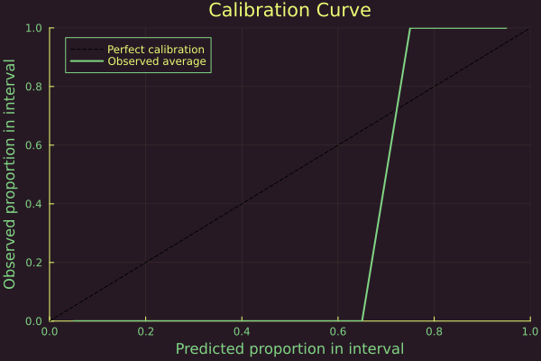

``` @meta
CurrentModule = LaplaceRedux
```

# Bayesian Logistic Regression

## Libraries

``` julia
using Pkg; Pkg.activate("docs")
# Import libraries
using Flux, Plots, TaijaPlotting, Random, Statistics, LaplaceRedux, LinearAlgebra
theme(:lime)
```

## Data

We will use synthetic data with linearly separable samples:

``` julia
# Number of points to generate.
xs, ys = LaplaceRedux.Data.toy_data_linear(100)
X = hcat(xs...) # bring into tabular format
```

split in a training and test set

``` julia
# Shuffle the data
n = length(ys)
indices = randperm(n)

# Define the split ratio
split_ratio = 0.8
split_index = Int(floor(split_ratio * n))

# Split the data into training and test sets
train_indices = indices[1:split_index]
test_indices = indices[split_index+1:end]

xs_train = xs[train_indices]
xs_test = xs[test_indices]
ys_train = ys[train_indices]
ys_test = ys[test_indices]
# bring into tabular format
X_train = hcat(xs_train...) 
X_test = hcat(xs_test...) 

data = zip(xs_train,ys_train)
```

## Model

Logistic regression with weight decay can be implemented in Flux.jl as a single dense (linear) layer with binary logit crossentropy loss:

``` julia
nn = Chain(Dense(2,1))
λ = 0.5
sqnorm(x) = sum(abs2, x)
weight_regularization(λ=λ) = 1/2 * λ^2 * sum(sqnorm, Flux.params(nn))
loss(x, y) = Flux.Losses.logitbinarycrossentropy(nn(x), y) + weight_regularization()
```

The code below simply trains the model. After about 50 training epochs training loss stagnates.

``` julia
using Flux.Optimise: update!, Adam
opt = Adam()
epochs = 50
avg_loss(data) = mean(map(d -> loss(d[1],d[2]), data))
show_every = epochs/10

for epoch = 1:epochs
  for d in data
    gs = gradient(Flux.params(nn)) do
      l = loss(d...)
    end
    update!(opt, Flux.params(nn), gs)
  end
  if epoch % show_every == 0
    println("Epoch " * string(epoch))
    @show avg_loss(data)
  end
end
```

## Laplace approximation

Laplace approximation for the posterior predictive can be implemented as follows:

``` julia
la = Laplace(nn; likelihood=:classification, λ=λ, subset_of_weights=:last_layer)
fit!(la, data)
la_untuned = deepcopy(la)   # saving for plotting
optimize_prior!(la; verbose=true, n_steps=500)
```

The plot below shows the resulting posterior predictive surface for the plugin estimator (left) and the Laplace approximation (right).

``` julia
zoom = 0
p_plugin = plot(la, X, ys; title="Plugin", link_approx=:plugin, clim=(0,1))
p_untuned = plot(la_untuned, X, ys; title="LA - raw (λ=$(unique(diag(la_untuned.prior.P₀))[1]))", clim=(0,1), zoom=zoom)
p_laplace = plot(la, X, ys; title="LA - tuned (λ=$(round(unique(diag(la.prior.P₀))[1],digits=2)))", clim=(0,1), zoom=zoom)
plot(p_plugin, p_untuned, p_laplace, layout=(1,3), size=(1700,400))
```


Now we can test the level of calibration of the neural network.
First we collect the predicted results over the test dataset

``` julia
 predicted_distributions= predict(la, X_test,ret_distr=true)
```

    1×20 Matrix{Distributions.Bernoulli{Float64}}:
     Distributions.Bernoulli{Float64}(p=0.967233)  …  Distributions.Bernoulli{Float64}(p=0.914255)

then we plot the calibration plot

``` julia
Calibration_Plot(la,ys_test,vec(predicted_distributions);n_bins = 20)
```



as we can see, although the network is extremely accurate it doesn’t seem to be calibrated well. This is however an effect of the extreme accuracy reached by the neural network which causes the lack of predictions with high uncertainty(low certainty), rather than a defect of the laplace approximation. We can see this by looking at the level of sharpness for the two classes which are extremely close to the extreme, indicating the high level of trust that the neural network has in the predictions.

``` julia
sharpness_classification(ys_test,vec(predicted_distributions))
```

    [0.06683468971570633, 0.09302258990939861, 0.04710001907982482, 0.03008829594669629, 0.06989057905539901, 0.23767498750256882, 0.018801990756895485, 0.01980662885791489, 0.024503167113718475]

    (0.9061756256800884, 0.9324752280068752)
