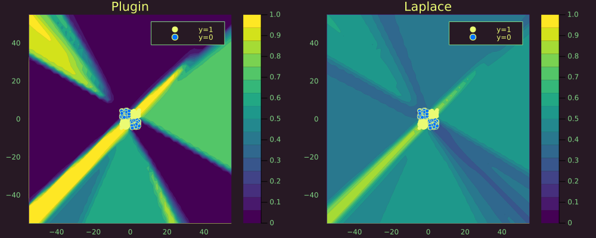

``` @meta
CurrentModule = LaplaceRedux
```

# Bayesian MLP

This time we use a synthetic dataset containing samples that are not linearly separable:

``` julia
# Number of points to generate.
xs, ys = toy_data_non_linear(200)
X = hcat(xs...) # bring into tabular format
data = zip(xs,ys)
```

For the classification task we build a neural network with weight decay composed of a single hidden layer.

``` julia
n_hidden = 32
D = size(X)[1]
nn = Chain(
    Dense(D, n_hidden, σ),
    Dense(n_hidden, 1)
)  
λ = 0.01
sqnorm(x) = sum(abs2, x)
weight_regularization(λ=λ) = 1/2 * λ^2 * sum(sqnorm, Flux.params(nn))
loss(x, y) = Flux.Losses.logitbinarycrossentropy(nn(x), y) + weight_regularization();
```

The model is trained for 200 epochs before the training loss stagnates.

``` julia
using Flux.Optimise: update!, Adam
opt = Adam()
epochs = 200
avg_loss(data) = mean(map(d -> loss(d[1],d[2]), data))
show_every = epochs/10

for epoch = 1:epochs
  for d in data
    gs = gradient(params(nn)) do
      l = loss(d...)
    end
    update!(opt, params(nn), gs)
  end
  if epoch % show_every == 0
    println("Epoch " * string(epoch))
    @show avg_loss(data)
  end
end
```

## Laplace appoximation

Laplace approximation can be implemented as follows:

``` julia
la = Laplace(nn, λ=λ, subset_of_weights=:last_layer)
fit!(la, data)
```

The plot below shows the resulting posterior predictive surface for the plugin estimator (left) and the Laplace approximation (right).

``` julia
# Plot the posterior distribution with a contour plot.
zoom=0
p_plugin = plot_contour(X',ys,la;title="Plugin",type=:plugin,zoom=zoom)
p_laplace = plot_contour(X',ys,la;title="Laplace",zoom=zoom)
plt = plot(p_plugin, p_laplace, layout=(1,2), size=(1000,400))
savefig(plt, joinpath(www_path, "posterior_predictive_mlp.png"))
```


Zooming out we can note that the plugin estimator produces high-confidence estimates in regions scarce of any samples. The Laplace approximation is much more conservative about these regions.

``` julia
zoom=-50
p_plugin = plot_contour(X',ys,la;title="Plugin",type=:plugin,zoom=zoom)
p_laplace = plot_contour(X',ys,la;title="Laplace",zoom=zoom)
# Plot the posterior distribution with a contour plot.
plt = plot(p_plugin, p_laplace, layout=(1,2), size=(1000,400))
savefig(plt, joinpath(www_path, "posterior_predictive_mlp_zoomed.png"))
```


