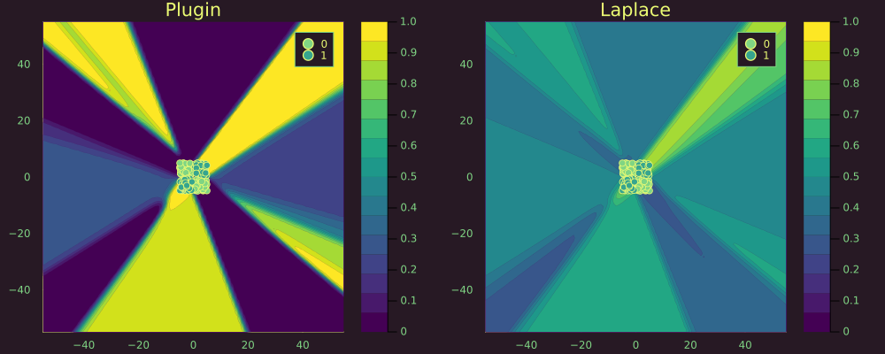

``` @meta
CurrentModule = LaplaceRedux
```

# Bayesian MLP

This time we use a synthetic dataset containing samples that are not linearly separable:

``` julia
# Number of points to generate.
xs, ys = LaplaceRedux.Data.toy_data_non_linear(200)
X = hcat(xs...) # bring into tabular format
data = zip(xs,ys)
```

For the classification task we build a neural network with weight decay composed of a single hidden layer.

``` julia
n_hidden = 32
D = size(X,1)
nn = Chain(
    Dense(D, n_hidden, σ),
    Dense(n_hidden, 1)
)  
loss(x, y) = Flux.Losses.logitbinarycrossentropy(nn(x), y) 
```

The model is trained for 200 epochs before the training loss stagnates.

``` julia
using Flux.Optimise: update!, Adam
opt = Adam()
epochs = 100
avg_loss(data) = mean(map(d -> loss(d[1],d[2]), data))
show_every = epochs/10

for epoch = 1:epochs
  for d in data
    gs = gradient(Flux.params(nn)) do
      l = loss(d...)
    end
    update!(opt, Flux.params(nn), gs)
  end
  if epoch % show_every == 0
    println("Epoch " * string(epoch))
    @show avg_loss(data)
  end
end
```

## Laplace Approximation

Laplace approximation can be implemented as follows:

``` julia
la = Laplace(nn; likelihood=:classification)
fit!(la, data)
la_untuned = deepcopy(la)   # saving for plotting
optimize_prior!(la; verbose=true, n_steps=500)
```

The plot below shows the resulting posterior predictive surface for the plugin estimator (left) and the Laplace approximation (right).

``` julia
# Plot the posterior distribution with a contour plot.
zoom=0
p_plugin = plot(la, X, ys; title="Plugin", link_approx=:plugin, clim=(0,1))
p_untuned = plot(la_untuned, X, ys; title="LA - raw (λ=$(unique(diag(la_untuned.P₀))[1]))", clim=(0,1), zoom=zoom)
p_laplace = plot(la, X, ys; title="LA - tuned (λ=$(round(unique(diag(la.P₀))[1],digits=2)))", clim=(0,1), zoom=zoom)
plot(p_plugin, p_untuned, p_laplace, layout=(1,3), size=(1700,400))
```


Zooming out we can note that the plugin estimator produces high-confidence estimates in regions scarce of any samples. The Laplace approximation is much more conservative about these regions.

``` julia
zoom=-50
p_plugin = plot(la, X, ys; title="Plugin", link_approx=:plugin, clim=(0,1))
p_untuned = plot(la_untuned, X, ys; title="LA - raw (λ=$(unique(diag(la_untuned.P₀))[1]))", clim=(0,1), zoom=zoom)
p_laplace = plot(la, X, ys; title="LA - tuned (λ=$(round(unique(diag(la.P₀))[1],digits=2)))", clim=(0,1), zoom=zoom)
plot(p_plugin, p_untuned, p_laplace, layout=(1,3), size=(1700,400))
```


