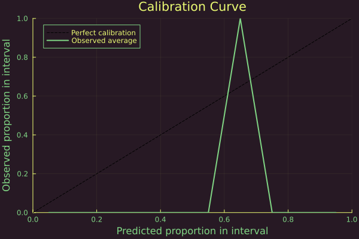

# Multi-class problem


## Libraries

``` julia
using Pkg; Pkg.activate("docs")
# Import libraries
using Flux, Plots, TaijaPlotting, Random, Statistics, LaplaceRedux
theme(:lime)
```

## Data

``` julia
using LaplaceRedux.Data
x, y = Data.toy_data_multi()
X = hcat(x...)
y_onehot = Flux.onehotbatch(y, unique(y))
y_onehot = Flux.unstack(y_onehot',1)
```

split in training and test datasets

``` julia
# Shuffle the data
n = length(y)
indices = randperm(n)

# Define the split ratio
split_ratio = 0.8
split_index = Int(floor(split_ratio * n))

# Split the data into training and test sets
train_indices = indices[1:split_index]
test_indices = indices[split_index+1:end]

x_train = x[train_indices]
x_test = x[test_indices]
y_onehot_train = y_onehot[train_indices,:]
y_onehot_test = y_onehot[test_indices,:]

y_train = vec(y[train_indices,:])
y_test = vec(y[test_indices,:])
# bring into tabular format
X_train = hcat(x_train...) 
X_test = hcat(x_test...) 

data = zip(x_train,y_onehot_train)
#data = zip(x,y_onehot)
```

## MLP

We set up a model

``` julia
n_hidden = 3
D = size(X,1)
out_dim = length(unique(y))
nn = Chain(
    Dense(D, n_hidden, σ),
    Dense(n_hidden, out_dim)
)  
loss(x, y) = Flux.Losses.logitcrossentropy(nn(x), y)
```

training:

``` julia
using Flux.Optimise: update!, Adam
opt = Adam()
epochs = 100
avg_loss(data) = mean(map(d -> loss(d[1],d[2]), data))
show_every = epochs/10

for epoch = 1:epochs
    for d in data
        gs = gradient(Flux.params(nn)) do
            l = loss(d...)
        end
        update!(opt, Flux.params(nn), gs)
    end
    if epoch % show_every == 0
        println("Epoch " * string(epoch))
        @show avg_loss(data)
    end
end
```

## Laplace Approximation

The Laplace approximation can be implemented as follows:

``` julia
la = Laplace(nn; likelihood=:classification)
fit!(la, data)
optimize_prior!(la; verbose=true, n_steps=100)
```

with either the probit approximation:

``` julia
_labels = sort(unique(y))
plt_list = []
for target in _labels
    plt = plot(la, X_test, y_test; target=target, clim=(0,1))
    push!(plt_list, plt)
end
plot(plt_list...)
```


or the plugin approximation:

``` julia
_labels = sort(unique(y))
plt_list = []
for target in _labels
    plt = plot(la, X_test, y_test; target=target, clim=(0,1), link_approx=:plugin)
    push!(plt_list, plt)
end
plot(plt_list...)
```


## Calibration Plots

In the case of multiclass classification tasks, we cannot plot directly the calibration plots since they can only be used in the binary classification case. However, we can use them to plot the calibration of the predictions for 1 class against all the others. To do so, we first have to collect the predicted categorical distributions

``` julia
predicted_distributions= predict(la, X_test,ret_distr=true)
```

    1×20 Matrix{Distributions.Categorical{Float64, Vector{Float64}}}:
     Distributions.Categorical{Float64, Vector{Float64}}(support=Base.OneTo(4), p=[0.677436, 0.0384923, 0.118736, 0.165336])  …  Distributions.Categorical{Float64, Vector{Float64}}(support=Base.OneTo(4), p=[0.0261611, 0.688918, 0.199687, 0.085234])

then we transform the categorical distributions into Bernoulli distributions by taking only the probability of the class of interest, for example the third one.

``` julia
using Distributions
bernoulli_distributions = [Bernoulli(p.p[3]) for p in vec(predicted_distributions)]
```

    20-element Vector{Bernoulli{Float64}}:
     Bernoulli{Float64}(p=0.11873558300173745)
     Bernoulli{Float64}(p=0.11498061136134086)
     Bernoulli{Float64}(p=0.6674405629824905)
     Bernoulli{Float64}(p=0.03286998149953749)
     Bernoulli{Float64}(p=0.6574893211057788)
     Bernoulli{Float64}(p=0.1133413386424115)
     Bernoulli{Float64}(p=0.11387611100108382)
     Bernoulli{Float64}(p=0.03241056796828973)
     Bernoulli{Float64}(p=0.6674299268262424)
     Bernoulli{Float64}(p=0.19985404101512141)
     Bernoulli{Float64}(p=0.03324098746202494)
     Bernoulli{Float64}(p=0.20007441459444497)
     Bernoulli{Float64}(p=0.19922259256089178)
     Bernoulli{Float64}(p=0.6697881738458813)
     Bernoulli{Float64}(p=0.03258399908041036)
     Bernoulli{Float64}(p=0.11381645240815817)
     Bernoulli{Float64}(p=0.03379412786302275)
     Bernoulli{Float64}(p=0.19994807070245754)
     Bernoulli{Float64}(p=0.11396233020534376)
     Bernoulli{Float64}(p=0.19968706593359128)

Now we can use the calibration Plot to see the level of calibration of the neural network

``` julia
plt = Calibration_Plot(la,hcat(y_onehot_test...)[3,:],bernoulli_distributions;n_bins = 20);
```



The plot is peaked around 0.7, and This may be due to various reasons.

A possible reason is that class 3 is relatively easy for the model to identify from the other classes. The network is able to correctly identify examples belonging to class 3, although he remains a bit underconfident in its predictions.
Another reason for the peak however may be the lack of cases where the predicted probability is lower (e.g., around 0.5), which could indicate that the network has not encountered ambiguous or difficult-to-classify examples for class 3. This once again might be because either class 3 has distinct features that the model can easily learn, leading to fewer uncertain predictions, or is a consequence of the limited dataset.

We can measure how sharp is the neural network by computing the sharpness score

sharpness_classification(hcat(y_onehot_test…)\[3,:\],bernoulli_distributions)

\`\`\`

The neural network seems to be able to correctly classify the majority of samples with a relative high confidence, although not to the level of the binary case. This is most likely due to the greater difficulty in classifying 4 different classes when compared to having to classify only two classes.
