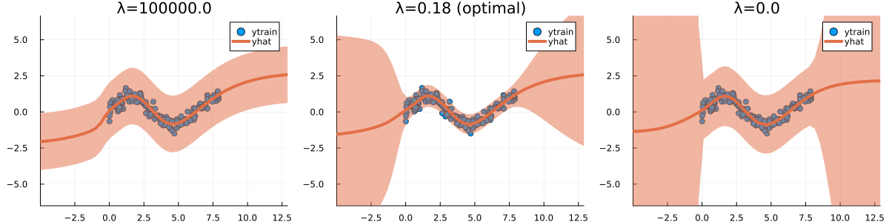
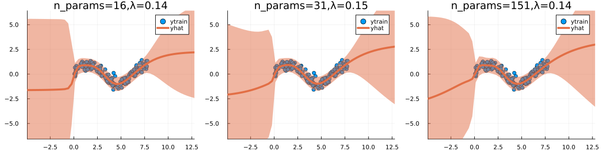

``` @meta
CurrentModule = LaplaceRedux
```

## Libraries

``` julia
using Pkg; Pkg.activate("docs")
# Import libraries
using Flux, Plots, TaijaPlotting, Random, Statistics, LaplaceRedux, LinearAlgebra
```

!!! note "In Progress"  
    This documentation is still incomplete.

## A quick note on the prior

### General Effect

High prior precision $\rightarrow$ only observation noise. Low prior precision $\rightarrow$ high posterior uncertainty.

``` julia
using LaplaceRedux.Data
n = 150       # number of observations
σtrue = 0.30  # true observational noise
x, y = Data.toy_data_regression(n;noise=σtrue)
xs = [[x] for x in x]
X = permutedims(x)
```

``` julia
data = zip(xs,y)
n_hidden = 10
D = size(X,1)
Λ = [1e5, nothing, 1e-5]
plts = []
nns = []
opt=Flux.Adam(1e-3)
for λ ∈ Λ
    nn = Chain(
        Dense(D, n_hidden, tanh),
        Dense(n_hidden, 1)
    )  
    loss(x, y) = Flux.Losses.mse(nn(x), y)
    # train
    epochs = 1000
    for epoch = 1:epochs
        for d in data
        gs = gradient(Flux.params(nn)) do
            l = loss(d...)
        end
        Flux.update!(opt, Flux.params(nn), gs)
        end
    end
    # laplace
    if !isnothing(λ)
        la = Laplace(nn; likelihood=:regression, λ=λ)
        fit!(la, data)  
    else
        la = Laplace(nn; likelihood=:regression)
        fit!(la, data)  
        optimize_prior!(la)
    end
    
    _suffix = isnothing(λ) ? " (optimal)" : ""
    λ = unique(diag(la.prior.P₀))[1]
    title = "λ=$(round(λ,digits=2))$(_suffix)"

    # plot 
    plt = plot(la, X, y; title=title, zoom=-5)
    plts = vcat(plts..., plt)
    nns = vcat(nns..., nn)
end
plot(plts..., layout=(1,3), size=(1200,300))
```



### Effect of Model Size on Optimal Choice

For larger models, the optimal prior precision $\lambda$ as evaluated through Empirical Bayes tends to be smaller.

``` julia
data = zip(xs,y)
n_hiddens = [5, 10, 50]
D = size(X,1)
plts = []
nns = []
opt=Flux.Adam(1e-3)
for n_hidden ∈ n_hiddens
    nn = Chain(
        Dense(D, n_hidden, tanh),
        Dense(n_hidden, 1)
    )  
    loss(x, y) = Flux.Losses.mse(nn(x), y)
    # train
    epochs = 1000
    for epoch = 1:epochs
        for d in data
        gs = gradient(Flux.params(nn)) do
            l = loss(d...)
        end
        Flux.update!(opt, Flux.params(nn), gs)
        end
    end
    # laplace
    la = Laplace(nn; likelihood=:regression)
    fit!(la, data)  
    optimize_prior!(la)
    
    λ = unique(diag(la.prior.P₀))[1]
    title = "n_params=$(LaplaceRedux.n_params(la)),λ=$(round(λ,digits=2))"

    # plot 
    plt = plot(la, X, y; title=title, zoom=-5)
    plts = vcat(plts..., plt)
    nns = vcat(nns..., nn)
end
plot(plts..., layout=(1,3), size=(1200,300))
```



``` julia
# Number of points to generate.
xs, ys = LaplaceRedux.Data.toy_data_non_linear(200)
X = hcat(xs...) # bring into tabular format
data = zip(xs,ys)

n_hiddens = [5, 10, 50]
D = size(X,1)
plts = []
nns = []
opt=Flux.Adam(1e-3)
for n_hidden ∈ n_hiddens
    nn = Chain(
        Dense(D, n_hidden, σ),
        Dense(n_hidden, 1)
    )  
    loss(x, y) = Flux.Losses.mse(nn(x), y)
    # train
    epochs = 100
    for epoch = 1:epochs
        for d in data
        gs = gradient(Flux.params(nn)) do
            l = loss(d...)
        end
        Flux.update!(opt, Flux.params(nn), gs)
        end
    end
    # laplace
    la = Laplace(nn; likelihood=:classification)
    fit!(la, data)  
    optimize_prior!(la)
    
    λ = unique(diag(la.prior.P₀))[1]
    title = "n_params=$(LaplaceRedux.n_params(la)),λ=$(round(λ,digits=2))"

    # plot 
    plt = plot(la, X, ys; title=title, zoom=-1, clim=(0,1))
    plts = vcat(plts..., plt)
    nns = vcat(nns..., nn)
end
plot(plts..., layout=(1,3), size=(1200,300))
```


