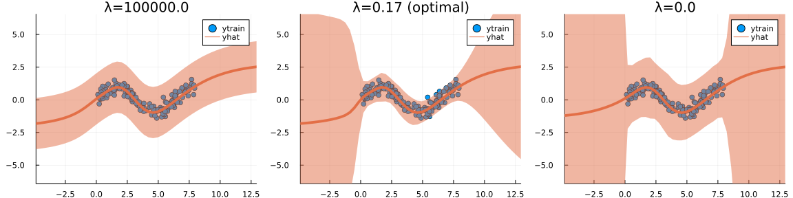
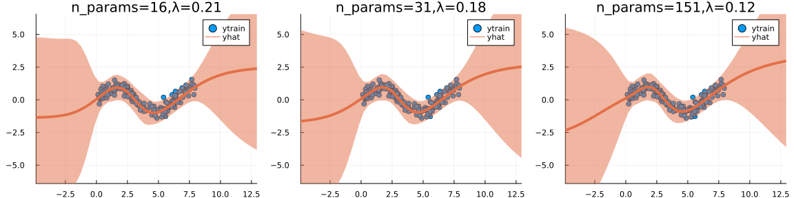
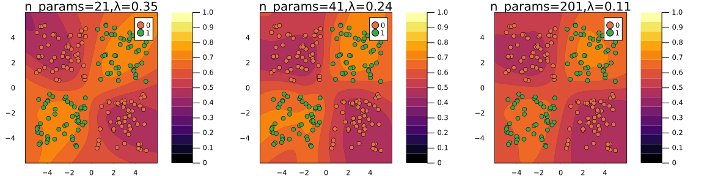

``` @meta
CurrentModule = LaplaceRedux
```

!!! note "In Progress"  
    This documentation is still incomplete.

## A quick note on the prior

### General Effect

High prior precision → only observation noise. Low prior precision → high posterior uncertainty.

``` julia
using LaplaceRedux.Data
n = 150       # number of observations
σtrue = 0.30  # true observational noise
x, y = Data.toy_data_regression(n;noise=σtrue)
xs = [[x] for x in x]
X = permutedims(x)
```



### Effect of Model Size on Optimal Choice

For larger models, the optimal prior precision *λ* as evaluated through Empirical Bayes tends to be smaller.




