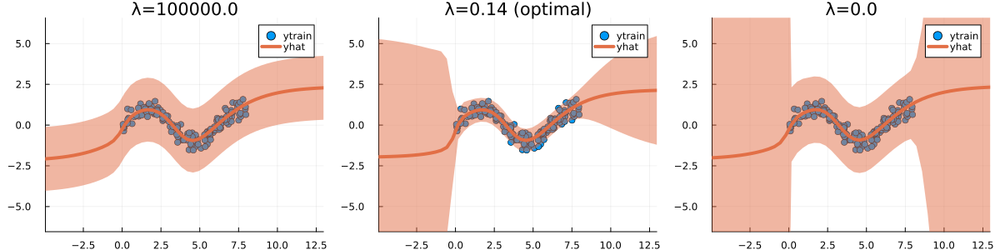

``` @meta
CurrentModule = LaplaceRedux
```

!!! Note "In Progress"  
    This documentation is still incomplete.

## A quick note on the prior

Low prior uncertainty → posterior dominated by prior. High prior uncertainty → posterior approaches MLE.

``` julia
# Number of points to generate:
xs, y = LaplaceRedux.Data.toy_data_non_linear(200)
X = hcat(xs...); # bring into tabular format
data = zip(xs,y)
```


