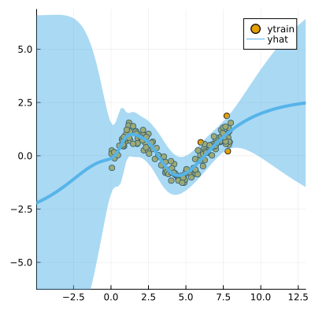

``` @meta
CurrentModule = LaplaceRedux
```

## Data

We first generate some synthetic data:

``` julia
using LaplaceRedux.Data
n = 150       # number of observations
σtrue = 0.30  # true observational noise
x, y = Data.toy_data_regression(n;noise=σtrue)
xs = [[x] for x in x]
X = permutedims(x)
```

## MLP

We set up a model and loss with weight regularization:

``` julia
data = zip(xs,y)
n_hidden = 50
D = size(X,1)
nn = Chain(
    Dense(D, n_hidden, tanh),
    Dense(n_hidden, 1)
)  
loss(x, y) = Flux.Losses.mse(nn(x), y)
```

We train the model:

``` julia
using Flux.Optimise: update!, Adam
opt = Adam(1e-3)
epochs = 1000
avg_loss(data) = mean(map(d -> loss(d[1],d[2]), data))
show_every = epochs/10

for epoch = 1:epochs
  for d in data
    gs = gradient(Flux.params(nn)) do
      l = loss(d...)
    end
    update!(opt, Flux.params(nn), gs)
  end
  if epoch % show_every == 0
    println("Epoch " * string(epoch))
    @show avg_loss(data)
  end
end
```

## Laplace Approximation

Laplace approximation can be implemented as follows:

``` julia
subset_w = :all
la = Laplace(nn; likelihood=:regression, subset_of_weights=subset_w)
fit!(la, data)
plot(la, X, y; zoom=-5, size=(400,400))
```


Next we optimize the prior precision *P*₀ and and observational noise *σ* using Empirical Bayes:

``` julia
optimize_prior!(la; verbose=true)
plot(la, X, y; zoom=-5, size=(400,400))
```

    Iteration 10: P₀=0.3895817899073436, σ=0.3743155211807906

    loss(exp.(logP₀), exp.(logσ)) = 57.82862051462456
    Iteration 20: P₀=0.19740377732969688, σ=0.22232904647966711
    loss(exp.(logP₀), exp.(logσ)) = 56.9828631315647
    Iteration 30: P₀=0.13730732318486746, σ=0.30407118191989013
    loss(exp.(logP₀), exp.(logσ)) = 46.453150536156386
    Iteration 40: P₀=0.12115811067346993, σ=0.3080945046886427
    loss(exp.(logP₀), exp.(logσ)) = 46.770263799396396
    Iteration 50: P₀=0.1225243267122822, σ=0.26950400534294194
    loss(exp.(logP₀), exp.(logσ)) = 46.367032506875915
    Iteration 60: P₀=0.1308469880921181, σ=0.2884000501866077
    loss(exp.(logP₀), exp.(logσ)) = 45.87856486201052

    Iteration 70: P₀=0.13983814051116947, σ=0.28798753052555986
    loss(exp.(logP₀), exp.(logσ)) = 45.85626199765708
    Iteration 80: P₀=0.14573256667723103, σ=0.28137446446795905
    loss(exp.(logP₀), exp.(logσ)) = 45.85903167427847
    Iteration 90: P₀=0.1477073935557212, σ=0.2869757911722043
    loss(exp.(logP₀), exp.(logσ)) = 45.844604952740006
    Iteration 100: P₀=0.1471549041911406, σ=0.2840891068076814
    loss(exp.(logP₀), exp.(logσ)) = 45.83742360639423


