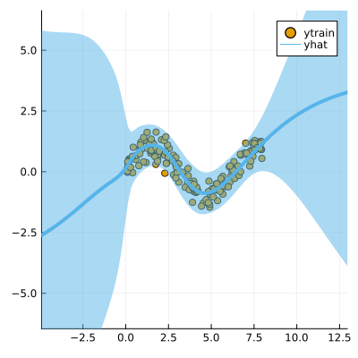

``` @meta
CurrentModule = LaplaceRedux
```

## Data

We first generate some synthetic data:

``` julia
using LaplaceRedux.Data
n = 300       # number of observations
σtrue = 0.30  # true observational noise
x, y = Data.toy_data_regression(n;noise=σtrue)
xs = [[x] for x in x]
X = permutedims(x)
```

## MLP

We set up a model and loss with weight regularization:

``` julia
data = zip(xs,y)
n_hidden = 50
D = size(X,1)
nn = Chain(
    Dense(D, n_hidden, tanh),
    Dense(n_hidden, 1)
)  
loss(x, y) = Flux.Losses.mse(nn(x), y)
```

We train the model:

``` julia
using Flux.Optimise: update!, Adam
opt = Adam(1e-3)
epochs = 1000
avg_loss(data) = mean(map(d -> loss(d[1],d[2]), data))
show_every = epochs/10

for epoch = 1:epochs
  for d in data
    gs = gradient(Flux.params(nn)) do
      l = loss(d...)
    end
    update!(opt, Flux.params(nn), gs)
  end
  if epoch % show_every == 0
    println("Epoch " * string(epoch))
    @show avg_loss(data)
  end
end
```

## Laplace Approximation

Laplace approximation can be implemented as follows:

``` julia
subset_w = :all
la = Laplace(nn; likelihood=:regression, subset_of_weights=subset_w)
fit!(la, data)
plot(la, X, y; zoom=-5, size=(400,400))
```


Next we optimize the prior precision *P*₀ and and observational noise *σ* using Empirical Bayes:

``` julia
optimize_prior!(la; verbose=true)
plot(la, X, y; zoom=-5, size=(400,400))
```

    loss(exp.(logP₀), exp.(logσ)) = 117.66664854620934
    Log likelihood: -85.92178189333164
    Log det ratio: 35.71426712713756
    Scatter: 27.77546617861784
    loss(exp.(logP₀), exp.(logσ)) = 121.87231511858798
    Log likelihood: -94.6377872523882
    Log det ratio: 40.7731858243348
    Scatter: 13.695869908064768
    loss(exp.(logP₀), exp.(logσ)) = 105.74544738246172
    Log likelihood: -79.26976568466756
    Log det ratio: 43.950740004518195
    Scatter: 9.000623391070134
    loss(exp.(logP₀), exp.(logσ)) = 103.88142914896216
    Log likelihood: -77.44149990175734
    Log det ratio: 45.50530524149423
    Scatter: 7.374553252915389
    loss(exp.(logP₀), exp.(logσ)) = 104.09479293926637
    Log likelihood: -77.63140243238486
    Log det ratio: 45.99843510214248
    Scatter: 6.928345911620529

    loss(exp.(logP₀), exp.(logσ)) = 103.3468498181464
    Log likelihood: -76.88770063543016
    Log det ratio: 45.92861066847996
    Scatter: 6.989687696952491
    loss(exp.(logP₀), exp.(logσ)) = 103.16246637027459
    Log likelihood: -76.71757535070529
    Log det ratio: 45.64189954216795
    Scatter: 7.247882496970637
    loss(exp.(logP₀), exp.(logσ)) = 103.16978958495622
    Log likelihood: -76.7341717145966
    Log det ratio: 45.34308830278303
    Scatter: 7.528147437936199
    loss(exp.(logP₀), exp.(logσ)) = 103.16445388078068
    Log likelihood: -76.73183970804324
    Log det ratio: 45.1273375561218
    Scatter: 7.737890789353098
    loss(exp.(logP₀), exp.(logσ)) = 103.15526534959244
    Log likelihood: -76.72294852715255
    Log det ratio: 45.01394675305761
    Scatter: 7.850686891822177


