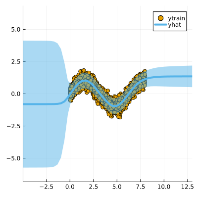

``` @meta
CurrentModule = LaplaceRedux
```

## Libraries

Import the libraries required to run this example

``` julia
using Pkg; Pkg.activate("docs")
# Import libraries
using Flux, Plots, TaijaPlotting, Random, Statistics, LaplaceRedux
theme(:wong)
```

## Data

We first generate some synthetic data:

``` julia
using LaplaceRedux.Data
n = 3000       # number of observations
σtrue = 0.30  # true observational noise
x, y = Data.toy_data_regression(n;noise=σtrue)
xs = [[x] for x in x]
X = permutedims(x)
```

and split them in a training set and a test set

``` julia
# Shuffle the data
Random.seed!(1234)  # Set a seed for reproducibility
shuffle_indices = shuffle(1:n)

# Define split ratios
train_ratio = 0.8
test_ratio = 0.2

# Calculate split indices
train_end = Int(floor(train_ratio * n))

# Split the data
train_indices = shuffle_indices[1:train_end]
test_indices = shuffle_indices[train_end+1:end]

# Create the splits
x_train, y_train = x[train_indices], y[train_indices]
x_test, y_test = x[test_indices], y[test_indices]

# Optional: Convert to desired format
xs_train = [[x] for x in x_train]
xs_test = [[x] for x in x_test]
X_train = permutedims(x_train)
X_test = permutedims(x_test)
```

## MLP

We set up a model and loss with weight regularization:

``` julia
train_data = zip(xs_train,y_train)
n_hidden = 50
D = size(X,1)
nn = Chain(
    Dense(D, n_hidden, tanh),
    Dense(n_hidden, 1)
)  
loss(x, y) = Flux.Losses.mse(nn(x), y)
```

We train the model:

``` julia
using Flux.Optimise: update!, Adam
opt = Adam(1e-3)
epochs = 1000
avg_loss(train_data) = mean(map(d -> loss(d[1],d[2]), train_data))
show_every = epochs/10

for epoch = 1:epochs
  for d in train_data
    gs = gradient(Flux.params(nn)) do
      l = loss(d...)
    end
    update!(opt, Flux.params(nn), gs)
  end
  if epoch % show_every == 0
    println("Epoch " * string(epoch))
    @show avg_loss(train_data)
  end
end
```

## Laplace Approximation

Laplace approximation can be implemented as follows:

``` julia
subset_w = :all
la = Laplace(nn; likelihood=:regression, subset_of_weights=subset_w)
fit!(la, train_data)
plot(la, X_train, y_train; zoom=-5, size=(400,400))
```


Next we optimize the prior precision $P_0$ and and observational noise $\sigma$ using Empirical Bayes:

``` julia
optimize_prior!(la; verbose=true)
plot(la, X_train, y_train; zoom=-5, size=(400,400))
```

    loss(exp.(logP₀), exp.(logσ)) = 699.4614071578686
    Log likelihood: -650.5288616722523
    Log det ratio: 66.18989615253814
    Scatter: 31.675194818694376
    loss(exp.(logP₀), exp.(logσ)) = 758.1137287674911
    Log likelihood: -713.3275341047802
    Log det ratio: 73.58411353906541
    Scatter: 15.98827578635654
    loss(exp.(logP₀), exp.(logσ)) = 623.1232220351936
    Log likelihood: -578.7313039580287
    Log det ratio: 77.76098439481223
    Scatter: 11.022851759517634

    loss(exp.(logP₀), exp.(logσ)) = 612.9000913546312
    Log likelihood: -568.4300289112797
    Log det ratio: 79.33032526731489
    Scatter: 9.609799619388047
    loss(exp.(logP₀), exp.(logσ)) = 612.980624661215
    Log likelihood: -568.5099348866323
    Log det ratio: 79.33795872667935
    Scatter: 9.603420822486008

    loss(exp.(logP₀), exp.(logσ)) = 606.4185627905605
    Log likelihood: -561.9934406760827
    Log det ratio: 78.67976558586915
    Scatter: 10.17047864308627
    loss(exp.(logP₀), exp.(logσ)) = 605.2983263524043
    Log likelihood: -560.9025071929581
    Log det ratio: 77.9541387818727
    Scatter: 10.83749953701965
    loss(exp.(logP₀), exp.(logσ)) = 605.464398184884
    Log likelihood: -561.0751506853986
    Log det ratio: 77.46246992569823
    Scatter: 11.316025073272467


    loss(exp.(logP₀), exp.(logσ)) = 605.4020214804258
    Log likelihood: -561.0122284359471
    Log det ratio: 77.26250383495702
    Scatter: 11.517082254000224
    loss(exp.(logP₀), exp.(logσ)) = 605.3141710440409
    Log likelihood: -560.924396603449
    Log det ratio: 77.2650076170082
    Scatter: 11.514541264175579



## Calibration Plot

Once the prior precision has been optimized it is possible to evaluate the quality of the predictive distribution
obtained through a calibration plot and a test dataset (y_test, X_test).

First, we apply the trained network on the test dataset (y_test, X_test) and collect the neural network’s predicted distributions

``` julia
predicted_distributions= predict(la, X_test,ret_distr=true)
```

    600×1 Matrix{Distributions.Normal{Float64}}:
     Distributions.Normal{Float64}(μ=-0.4196469187736511, σ=0.0679738666764263)
     Distributions.Normal{Float64}(μ=-0.39177197217941284, σ=0.06890169312970602)
     Distributions.Normal{Float64}(μ=0.776796281337738, σ=0.06074957252594663)
     Distributions.Normal{Float64}(μ=0.6933168172836304, σ=0.08344435466780176)
     Distributions.Normal{Float64}(μ=0.832196831703186, σ=0.08084460912585997)
     Distributions.Normal{Float64}(μ=-0.050286442041397095, σ=0.06884885797502903)
     Distributions.Normal{Float64}(μ=-0.5049006938934326, σ=0.06568541695736727)
     Distributions.Normal{Float64}(μ=-0.06951528787612915, σ=0.05514742556492769)
     Distributions.Normal{Float64}(μ=0.7513407468795776, σ=0.05183199458344559)
     Distributions.Normal{Float64}(μ=-0.3874087929725647, σ=0.06904606151969317)
     Distributions.Normal{Float64}(μ=-0.9113342761993408, σ=0.06564413451854467)
     Distributions.Normal{Float64}(μ=-0.24987715482711792, σ=0.05616188450864741)
     Distributions.Normal{Float64}(μ=0.9503012299537659, σ=0.05509250127866398)
     ⋮
     Distributions.Normal{Float64}(μ=-0.5406216979026794, σ=0.055769675132711756)
     Distributions.Normal{Float64}(μ=0.31152284145355225, σ=0.05454183352368205)
     Distributions.Normal{Float64}(μ=1.061593770980835, σ=0.07329565553777241)
     Distributions.Normal{Float64}(μ=0.12588687241077423, σ=0.06686624669227054)
     Distributions.Normal{Float64}(μ=0.058063820004463196, σ=0.11908083025214214)
     Distributions.Normal{Float64}(μ=1.028564691543579, σ=0.06796776553390338)
     Distributions.Normal{Float64}(μ=0.6847273111343384, σ=0.06322761308748256)
     Distributions.Normal{Float64}(μ=1.0285106897354126, σ=0.06796223500400367)
     Distributions.Normal{Float64}(μ=0.05158938467502594, σ=0.12225229033768022)
     Distributions.Normal{Float64}(μ=-0.06038850545883179, σ=0.055088019072815825)
     Distributions.Normal{Float64}(μ=0.8001070022583008, σ=0.06048200018805775)
     Distributions.Normal{Float64}(μ=0.5859723091125488, σ=0.0863628028315014)

then we can plot the calibration plot of our neural model

``` julia
Calibration_Plot(la,y_test,vec(predicted_distributions);n_bins = 20)
```


and compute the sharpness of the predictive distribution

``` julia
sharpness_regression(vec(predicted_distributions))
```

    0.004975154105351387
