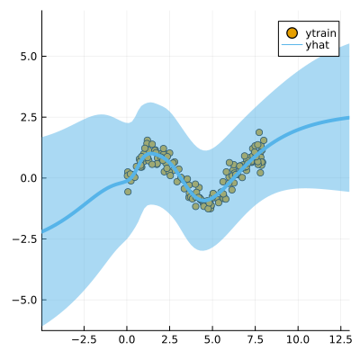
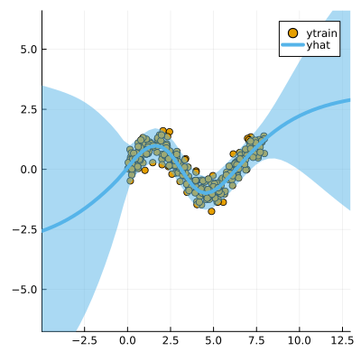

``` @meta
CurrentModule = LaplaceRedux
```

## Data

We first generate some synthetic data:

``` julia
using LaplaceRedux.Data
n = 300       # number of observations
σtrue = 0.30  # true observational noise
x, y = Data.toy_data_regression(n;noise=σtrue)
xs = [[x] for x in x]
X = permutedims(x)
```

## MLP

We set up a model and loss with weight regularization:

``` julia
using Flux
data = zip(xs,y)
n_hidden = 50
D = size(X,1)
nn = Chain(
    Dense(D, n_hidden, tanh),
    Dense(n_hidden, 1)
)  
loss(x, y) = Flux.Losses.mse(nn(x), y)
```

We train the model:

``` julia
using Flux.Optimise: update!, Adam
using Statistics
opt = Adam(1e-3)
epochs = 1000
avg_loss(data) = mean(map(d -> loss(d[1],d[2]), data))
show_every = epochs/10

for epoch = 1:epochs
  for d in data
    gs = gradient(Flux.params(nn)) do
      l = loss(d...)
    end
    update!(opt, Flux.params(nn), gs)
  end
  if epoch % show_every == 0
    println("Epoch " * string(epoch))
    @show avg_loss(data)
  end
end
```

## Laplace Approximation

Laplace approximation can be implemented as follows:

``` julia
using Plots
using TaijaPlotting
subset_w = :all
la = Laplace(nn; likelihood=:regression, subset_of_weights=subset_w)
fit!(la, data)
plot(la, X, y; zoom=-5, size=(400,400))
```



Next we optimize the prior precision $P_0$ and and observational noise $\sigma$ using Empirical Bayes:

``` julia
optimize_prior!(la; verbose=true)
plot(la, X, y; zoom=-5, size=(400,400))
```

    loss(exp.(logP₀), exp.(logσ)) = 124.30892828437838
    Log likelihood: -92.90051444935894
    Log det ratio: 40.658383861905975
    Scatter: 22.15844380813291
    loss(exp.(logP₀), exp.(logσ)) = 130.81658756749727
    Log likelihood: -102.38911604652068
    Log det ratio: 45.69949273706189
    Scatter: 11.155450304891295
    loss(exp.(logP₀), exp.(logσ)) = 117.38076793615893
    Log likelihood: -89.25592255384686
    Log det ratio: 48.59462871227015
    Scatter: 7.655062052354006
    loss(exp.(logP₀), exp.(logσ)) = 114.88202732095019
    Log likelihood: -86.70548060362589
    Log det ratio: 49.71436271446572
    Scatter: 6.638730720182862
    loss(exp.(logP₀), exp.(logσ)) = 115.26415029719183
    Log likelihood: -87.08424763856297
    Log det ratio: 49.75555914247877
    Scatter: 6.60424617477896
    loss(exp.(logP₀), exp.(logσ)) = 114.61842761360316
    Log likelihood: -86.46860147471742
    Log det ratio: 49.32651563215006
    Scatter: 6.973136645621423
    loss(exp.(logP₀), exp.(logσ)) = 114.39008804031867
    Log likelihood: -86.26082328115449
    Log det ratio: 48.8367441519502
    Scatter: 7.421785366378184
    loss(exp.(logP₀), exp.(logσ)) = 114.38876489620353
    Log likelihood: -86.26458532181827
    Log det ratio: 48.49569624521385
    Scatter: 7.752662903556662
    loss(exp.(logP₀), exp.(logσ)) = 114.3921409222427
    Log likelihood: -86.26770107709343
    Log det ratio: 48.349001843084864
    Scatter: 7.899877847213686
    loss(exp.(logP₀), exp.(logσ)) = 114.38668455910438
    Log likelihood: -86.26219437624869
    Log det ratio: 48.34197553950503
    Scatter: 7.907004826206364


