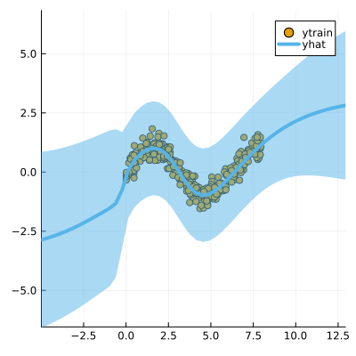

``` @meta
CurrentModule = LaplaceRedux
```

## Data

We first generate some synthetic data:

``` julia
using LaplaceRedux.Data
n = 300       # number of observations
σtrue = 0.30  # true observational noise
x, y = Data.toy_data_regression(n;noise=σtrue)
xs = [[x] for x in x]
X = permutedims(x)
```

## MLP

We set up a model and loss with weight regularization:

``` julia
data = zip(xs,y)
n_hidden = 50
D = size(X,1)
nn = Chain(
    Dense(D, n_hidden, tanh),
    Dense(n_hidden, 1)
)  
loss(x, y) = Flux.Losses.mse(nn(x), y)
```

We train the model:

``` julia
using Flux.Optimise: update!, Adam
opt = Adam(1e-3)
epochs = 1000
avg_loss(data) = mean(map(d -> loss(d[1],d[2]), data))
show_every = epochs/10

for epoch = 1:epochs
  for d in data
    gs = gradient(Flux.params(nn)) do
      l = loss(d...)
    end
    update!(opt, Flux.params(nn), gs)
  end
  if epoch % show_every == 0
    println("Epoch " * string(epoch))
    @show avg_loss(data)
  end
end
```

## Laplace Approximation

Laplace approximation can be implemented as follows:

``` julia
subset_w = :all
la = Laplace(nn; likelihood=:regression, subset_of_weights=subset_w)
fit!(la, data)
plot(la, X, y; zoom=-5, size=(400,400))
```



Next we optimize the prior precision *P*₀ and and observational noise *σ* using Empirical Bayes:

``` julia
optimize_prior!(la; verbose=true)
plot(la, X, y; zoom=-5, size=(400,400))
```

    loss(exp.(logP₀), exp.(logσ)) = 115.89970006409075
    Log likelihood: -78.9395891640363
    Log det ratio: 41.59099583534049
    Scatter: 32.329225964768405
    loss(exp.(logP₀), exp.(logσ)) = 117.64871821240808
    Log likelihood: -86.21271638531181
    Log det ratio: 47.02391032864642
    Scatter: 15.848093325546113
    loss(exp.(logP₀), exp.(logσ)) = 99.0503686829033
    Log likelihood: -68.6539632244081
    Log det ratio: 50.50904634071264
    Scatter: 10.283764576277756
    loss(exp.(logP₀), exp.(logσ)) = 97.95806446351698
    Log likelihood: -67.6630665366047
    Log det ratio: 52.31062172238063
    Scatter: 8.27937413144392
    loss(exp.(logP₀), exp.(logσ)) = 97.87638521130879
    Log likelihood: -67.56210824487965
    Log det ratio: 52.99651119671768
    Scatter: 7.632042736140583
    loss(exp.(logP₀), exp.(logσ)) = 97.0348007783304
    Log likelihood: -66.71699326917162
    Log det ratio: 53.06607882969837
    Scatter: 7.569536188619179
    loss(exp.(logP₀), exp.(logσ)) = 96.90880533777283
    Log likelihood: -66.60043898495907
    Log det ratio: 52.86479666828444
    Scatter: 7.751936037343088
    loss(exp.(logP₀), exp.(logσ)) = 96.92278577215899
    Log likelihood: -66.62313517903836
    Log det ratio: 52.601352698984954
    Scatter: 7.997948487256308
    loss(exp.(logP₀), exp.(logσ)) = 96.90753961129343
    Log likelihood: -66.6118899797289
    Log det ratio: 52.382272284239775
    Scatter: 8.20902697888927
    loss(exp.(logP₀), exp.(logσ)) = 96.8946599908052
    Log likelihood: -66.59997317019008
    Log det ratio: 52.24377877042417
    Scatter: 8.345594870806066


