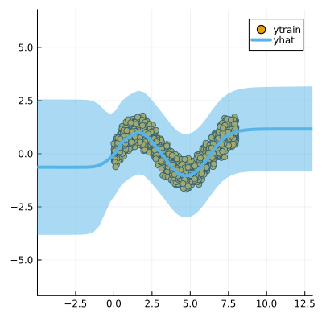

``` @meta
CurrentModule = LaplaceRedux
```

## Libraries

Import the libraries required to run this example

``` julia
using Pkg; Pkg.activate("docs")
# Import libraries
using Flux, Plots, TaijaPlotting, Random, Statistics, LaplaceRedux
theme(:wong)
```

## Data

We first generate some synthetic data:

``` julia
using LaplaceRedux.Data
n = 3000       # number of observations
σtrue = 0.30  # true observational noise
x, y = Data.toy_data_regression(n;noise=σtrue,seed=1234)
xs = [[x] for x in x]
X = permutedims(x)
```

and split them in a training set and a test set

``` julia
# Shuffle the data
Random.seed!(1234)  # Set a seed for reproducibility
shuffle_indices = shuffle(1:n)

# Define split ratios
train_ratio = 0.8
test_ratio = 0.2

# Calculate split indices
train_end = Int(floor(train_ratio * n))

# Split the data
train_indices = shuffle_indices[1:train_end]
test_indices = shuffle_indices[train_end+1:end]

# Create the splits
x_train, y_train = x[train_indices], y[train_indices]
x_test, y_test = x[test_indices], y[test_indices]

# Optional: Convert to desired format
xs_train = [[x] for x in x_train]
xs_test = [[x] for x in x_test]
X_train = permutedims(x_train)
X_test = permutedims(x_test)
```

## MLP

We set up a model and loss with weight regularization:

``` julia
train_data = zip(xs_train,y_train)
n_hidden = 50
D = size(X,1)
nn = Chain(
    Dense(D, n_hidden, tanh),
    Dense(n_hidden, 1)
)  
loss(x, y) = Flux.Losses.mse(nn(x), y)
```

We train the model:

``` julia
using Flux.Optimise: update!, Adam
opt = Adam(1e-3)
epochs = 1000
avg_loss(train_data) = mean(map(d -> loss(d[1],d[2]), train_data))
show_every = epochs/10

for epoch = 1:epochs
  for d in train_data
    gs = gradient(Flux.params(nn)) do
      l = loss(d...)
    end
    update!(opt, Flux.params(nn), gs)
  end
  if epoch % show_every == 0
    println("Epoch " * string(epoch))
    @show avg_loss(train_data)
  end
end
```

## Laplace Approximation

Laplace approximation can be implemented as follows:

``` julia
subset_w = :all
la = Laplace(nn; likelihood=:regression, subset_of_weights=subset_w)
fit!(la, train_data)
plot(la, X_train, y_train; zoom=-5, size=(400,400))
```



Next we optimize the prior precision $P_0$ and and observational noise $\sigma$ using Empirical Bayes:

``` julia
optimize_prior!(la; verbosity=1)
plot(la, X_train, y_train; zoom=-5, size=(400,400))
```

    loss(exp.(logP₀), exp.(logσ)) = 668.3714946472106
    Log likelihood: -618.5175117610522
    Log det ratio: 68.76532606873238
    Scatter: 30.942639703584522
    loss(exp.(logP₀), exp.(logσ)) = 719.2536119935747
    Log likelihood: -673.0996963447847
    Log det ratio: 76.53255037599948
    Scatter: 15.775280921580569
    loss(exp.(logP₀), exp.(logσ)) = 574.605864472924
    Log likelihood: -528.694286608232


    Log det ratio: 80.73114330857285
    Scatter: 11.092012420811196
    loss(exp.(logP₀), exp.(logσ)) = 568.4433850825203
    Log likelihood: -522.4407550111031
    Log det ratio: 82.10089958560243
    Scatter: 9.90436055723207


    loss(exp.(logP₀), exp.(logσ)) = 566.9485255672008
    Log likelihood: -520.9682443835385
    Log det ratio: 81.84516297272847
    Scatter: 10.11539939459612
    loss(exp.(logP₀), exp.(logσ)) = 559.9852101992792
    Log likelihood: -514.0625630685765
    Log det ratio: 80.97813304453496
    Scatter: 10.867161216870441

    loss(exp.(logP₀), exp.(logσ)) = 559.1404593114019
    Log likelihood: -513.2449017869876
    Log det ratio: 80.16026747795866
    Scatter: 11.630847570869795
    loss(exp.(logP₀), exp.(logσ)) = 559.3201392562346
    Log likelihood: -513.4273312363501
    Log det ratio: 79.68892769076004
    Scatter: 12.096688349008877


    loss(exp.(logP₀), exp.(logσ)) = 559.2111983983311
    Log likelihood: -513.3174948065804
    Log det ratio: 79.56631681347287
    Scatter: 12.2210903700287
    loss(exp.(logP₀), exp.(logσ)) = 559.1107459310829
    Log likelihood: -513.2176579845662
    Log det ratio: 79.63946732368183
    Scatter: 12.146708569351494


## Calibration Plot

Once the prior precision has been optimized it is possible to evaluate the quality of the predictive distribution
obtained through a calibration plot and a test dataset (y_test, X_test).

First, we apply the trained network on the test dataset (y_test, X_test) and collect the neural network’s predicted distributions

``` julia
predicted_distributions= predict(la, X_test,ret_distr=true)
```

    600×1 Matrix{Distributions.Normal{Float64}}:
     Distributions.Normal{Float64}(μ=-0.1137533187866211, σ=0.07161056521032018)
     Distributions.Normal{Float64}(μ=0.7063850164413452, σ=0.050697938829269665)
     Distributions.Normal{Float64}(μ=-0.2211049497127533, σ=0.06876939416479119)
     Distributions.Normal{Float64}(μ=0.720299243927002, σ=0.08665125572287981)
     Distributions.Normal{Float64}(μ=-0.8338974714279175, σ=0.06464012115237727)
     Distributions.Normal{Float64}(μ=0.9910320043563843, σ=0.07452060172164382)
     Distributions.Normal{Float64}(μ=0.1507074236869812, σ=0.07316299850461126)
     Distributions.Normal{Float64}(μ=0.20875799655914307, σ=0.05507748397231652)
     Distributions.Normal{Float64}(μ=0.973572850227356, σ=0.07899004963915071)
     Distributions.Normal{Float64}(μ=0.9497100114822388, σ=0.07750126389821968)
     Distributions.Normal{Float64}(μ=0.22462180256843567, σ=0.07103664786246695)
     Distributions.Normal{Float64}(μ=-0.7654240131378174, σ=0.05501397704409917)
     Distributions.Normal{Float64}(μ=1.0029183626174927, σ=0.07619466916431794)
     ⋮
     Distributions.Normal{Float64}(μ=0.7475956678390503, σ=0.049875919157527815)
     Distributions.Normal{Float64}(μ=0.019430622458457947, σ=0.07445076746045155)
     Distributions.Normal{Float64}(μ=-0.9451781511306763, σ=0.05929712369810892)
     Distributions.Normal{Float64}(μ=-0.9813591241836548, σ=0.05844012710417755)
     Distributions.Normal{Float64}(μ=-0.6470385789871216, σ=0.055754609087554294)
     Distributions.Normal{Float64}(μ=-0.34288135170936584, σ=0.05533523375842789)
     Distributions.Normal{Float64}(μ=0.9912381172180176, σ=0.07872473667398772)
     Distributions.Normal{Float64}(μ=-0.824547290802002, σ=0.05499258101374759)
     Distributions.Normal{Float64}(μ=-0.3306621015071869, σ=0.06745251908756716)
     Distributions.Normal{Float64}(μ=0.3742436170578003, σ=0.10588913330223387)
     Distributions.Normal{Float64}(μ=0.0875578224658966, σ=0.07436153828228255)
     Distributions.Normal{Float64}(μ=-0.34871187806129456, σ=0.06742745343084512)

then we can plot the calibration plot of our neural model

``` julia
Calibration_Plot(la,y_test,vec(predicted_distributions);n_bins = 20)
```


and compute the sharpness of the predictive distribution

``` julia
sharpness_regression(vec(predicted_distributions))
```

    0.005058067743863281
