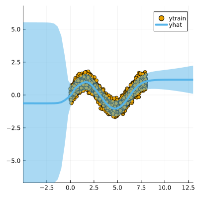

``` @meta
CurrentModule = LaplaceRedux
```

## Libraries

Import the libraries required to run this example

``` julia
using Pkg; Pkg.activate("docs")
# Import libraries
using Flux, Plots, TaijaPlotting, Random, Statistics, LaplaceRedux
theme(:wong)
```

## Data

We first generate some synthetic data:

``` julia
using LaplaceRedux.Data
n = 3000       # number of observations
σtrue = 0.30  # true observational noise
x, y = Data.toy_data_regression(n;noise=σtrue)
xs = [[x] for x in x]
X = permutedims(x)
```

and split them in a training set and a test set

``` julia
# Shuffle the data
Random.seed!(1234)  # Set a seed for reproducibility
shuffle_indices = shuffle(1:n)

# Define split ratios
train_ratio = 0.8
test_ratio = 0.2

# Calculate split indices
train_end = Int(floor(train_ratio * n))

# Split the data
train_indices = shuffle_indices[1:train_end]
test_indices = shuffle_indices[train_end+1:end]

# Create the splits
x_train, y_train = x[train_indices], y[train_indices]
x_test, y_test = x[test_indices], y[test_indices]

# Optional: Convert to desired format
xs_train = [[x] for x in x_train]
xs_test = [[x] for x in x_test]
X_train = permutedims(x_train)
X_test = permutedims(x_test)
```

## MLP

We set up a model and loss with weight regularization:

``` julia
train_data = zip(xs_train,y_train)
n_hidden = 50
D = size(X,1)
nn = Chain(
    Dense(D, n_hidden, tanh),
    Dense(n_hidden, 1)
)  
loss(x, y) = Flux.Losses.mse(nn(x), y)
```

We train the model:

``` julia
using Flux.Optimise: update!, Adam
opt = Adam(1e-3)
epochs = 1000
avg_loss(train_data) = mean(map(d -> loss(d[1],d[2]), train_data))
show_every = epochs/10

for epoch = 1:epochs
  for d in train_data
    gs = gradient(Flux.params(nn)) do
      l = loss(d...)
    end
    update!(opt, Flux.params(nn), gs)
  end
  if epoch % show_every == 0
    println("Epoch " * string(epoch))
    @show avg_loss(train_data)
  end
end
```

## Laplace Approximation

Laplace approximation can be implemented as follows:

``` julia
subset_w = :all
la = Laplace(nn; likelihood=:regression, subset_of_weights=subset_w)
fit!(la, train_data)
plot(la, X_train, y_train; zoom=-5, size=(400,400))
```


Next we optimize the prior precision $P_0$ and and observational noise $\sigma$ using Empirical Bayes:

``` julia
optimize_prior!(la; verbose=true)
plot(la, X_train, y_train; zoom=-5, size=(400,400))
```

    loss(exp.(logP₀), exp.(logσ)) = 702.3984988592939
    Log likelihood: -655.4226779297866
    Log det ratio: 63.636037890555485
    Scatter: 30.315603968459115
    loss(exp.(logP₀), exp.(logσ)) = 762.3739203559888
    Log likelihood: -719.2893446531043
    Log det ratio: 70.83089414166076
    Scatter: 15.338257264108307
    loss(exp.(logP₀), exp.(logσ)) = 628.966608466347
    Log likelihood: -586.2236101292576
    Log det ratio: 74.86014124914948
    Scatter: 10.625855425029199


    loss(exp.(logP₀), exp.(logσ)) = 618.1490551810743
    Log likelihood: -575.3262768621464
    Log det ratio: 76.32699108193992
    Scatter: 9.318565555915965
    loss(exp.(logP₀), exp.(logσ)) = 618.4368182243323
    Log likelihood: -575.6185033852381
    Log det ratio: 76.27376400937706
    Scatter: 9.362865668811326

    loss(exp.(logP₀), exp.(logσ)) = 611.9419028847238
    Log likelihood: -569.1706791963551
    Log det ratio: 75.59010798146141
    Scatter: 9.952339395276015
    loss(exp.(logP₀), exp.(logσ)) = 610.7840744675561
    Log likelihood: -568.0409279734597
    Log det ratio: 74.8667416715335
    Scatter: 10.619551316659306
    loss(exp.(logP₀), exp.(logσ)) = 610.9475830180504
    Log likelihood: -568.2098996989031
    Log det ratio: 74.39427933020599
    Scatter: 11.081087308088774

    loss(exp.(logP₀), exp.(logσ)) = 610.8918867270929
    Log likelihood: -568.1535043639661
    Log det ratio: 74.21729022268943
    Scatter: 11.259474503564268
    loss(exp.(logP₀), exp.(logσ)) = 610.8059882464455
    Log likelihood: -568.0677514294256
    Log det ratio: 74.23591352633076
    Scatter: 11.24056010770908



## Calibration Plot

Once the prior precision has been optimized it is possible to evaluate the quality of the predictive distribution
obtained through a calibration plot and a test dataset (y_test, X_test).

First, we apply the trained network on the test dataset (y_test, X_test) and collect the neural network’s predicted distributions

``` julia
predicted_distributions= predict(la, X_test,ret_distr=true)
```

    600×1 Matrix{Distributions.Normal{Float64}}:
     Distributions.Normal{Float64}(μ=0.9150201678276062, σ=0.0712698621939572)
     Distributions.Normal{Float64}(μ=0.2141074538230896, σ=0.08509629880573434)
     Distributions.Normal{Float64}(μ=0.43884706497192383, σ=0.05711459300259106)
     Distributions.Normal{Float64}(μ=-0.696795642375946, σ=0.0528907494338802)
     Distributions.Normal{Float64}(μ=-0.4487711787223816, σ=0.05667919814727773)
     Distributions.Normal{Float64}(μ=1.0599703788757324, σ=0.07331830051512468)
     Distributions.Normal{Float64}(μ=-0.6711699366569519, σ=0.0531862091132709)
     Distributions.Normal{Float64}(μ=0.7063796520233154, σ=0.07448023253385215)
     Distributions.Normal{Float64}(μ=-0.5376694798469543, σ=0.05548268083704169)
     Distributions.Normal{Float64}(μ=-0.4553452730178833, σ=0.06913082294474085)
     Distributions.Normal{Float64}(μ=-0.7690489888191223, σ=0.0528685253654398)
     Distributions.Normal{Float64}(μ=-0.7591468691825867, σ=0.06655473146173639)
     Distributions.Normal{Float64}(μ=0.09281894564628601, σ=0.13290530919567922)
     ⋮
     Distributions.Normal{Float64}(μ=-0.8616088032722473, σ=0.05546205318284079)
     Distributions.Normal{Float64}(μ=-0.593717634677887, σ=0.07036250789010345)
     Distributions.Normal{Float64}(μ=-0.9107488989830017, σ=0.05602522103411315)
     Distributions.Normal{Float64}(μ=0.687362790107727, σ=0.07600257202140666)
     Distributions.Normal{Float64}(μ=0.15490028262138367, σ=0.05495145734017776)
     Distributions.Normal{Float64}(μ=-0.807168185710907, σ=0.05354646272047298)
     Distributions.Normal{Float64}(μ=-0.28883808851242065, σ=0.06961852085326199)
     Distributions.Normal{Float64}(μ=0.8665060997009277, σ=0.050668256164857886)
     Distributions.Normal{Float64}(μ=0.053950488567352295, σ=0.07557626514837819)
     Distributions.Normal{Float64}(μ=0.10951238870620728, σ=0.0750927300730865)
     Distributions.Normal{Float64}(μ=0.41646575927734375, σ=0.08247027059087846)
     Distributions.Normal{Float64}(μ=-0.30292409658432007, σ=0.05713547559568841)

then we can plot the calibration plot of our neural model

``` julia
Calibration_Plot(la,y_test,vec(predicted_distributions);n_bins = 20)
```


and compute the sharpness of the predictive distribution

``` julia
sharpness_regression(vec(predicted_distributions))
```

    0.004653979376388681
